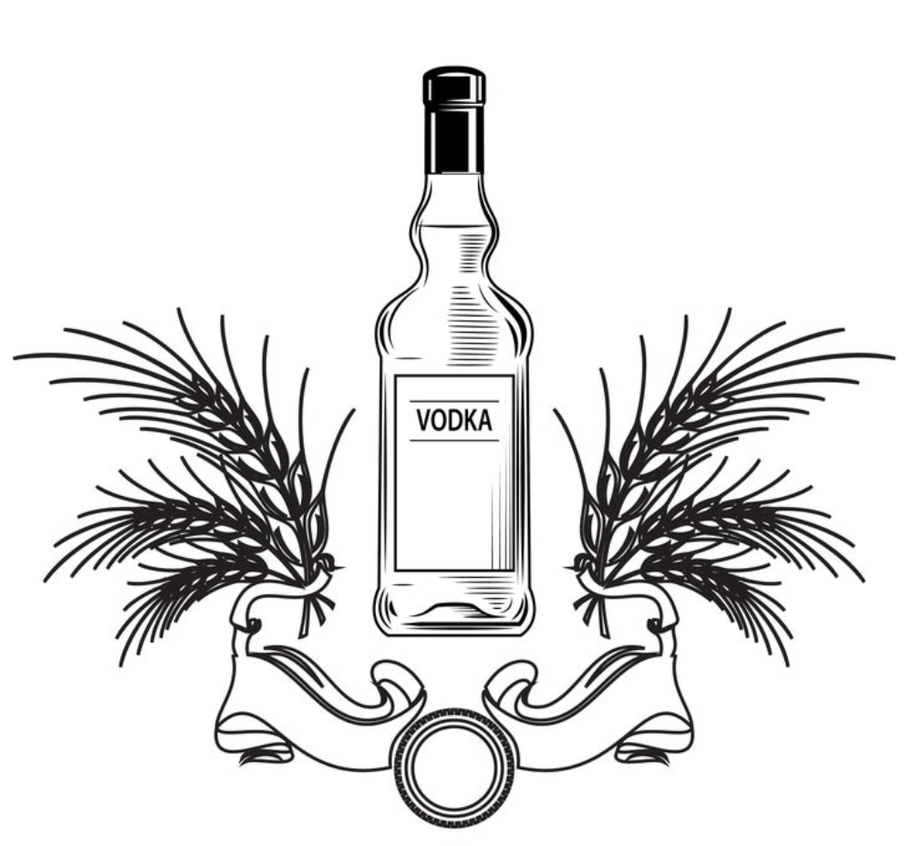

# Vodka MicroServices Framework 

vodka 轻量级golang微服务框架  Lightweight golang microservices framework

### 轻量级可扩展微服务框架
- [x] 服务注册             
- [x] 服务发现             
- [x] 负载均衡             
- [ ] 健康检测             
- [x] GRPC整合            
- [ ] 自动化代码生成        
- [ ] middleware设计       
- [ ] 监控设计             
- [ ] 配置文件集成          
- [ ] 限流middleware       
- [ ] 分布式追踪middleware  

### 服务目录规范
- controller     服务方法实现
- idl            服务idl定义
- main           入口
- scripts        服务脚本
- conf           服务配置文件
- app/router     服务路由
- app/config     解析配置文件代码
- datamodels     服务实体  
- generate       grpc生成代码
